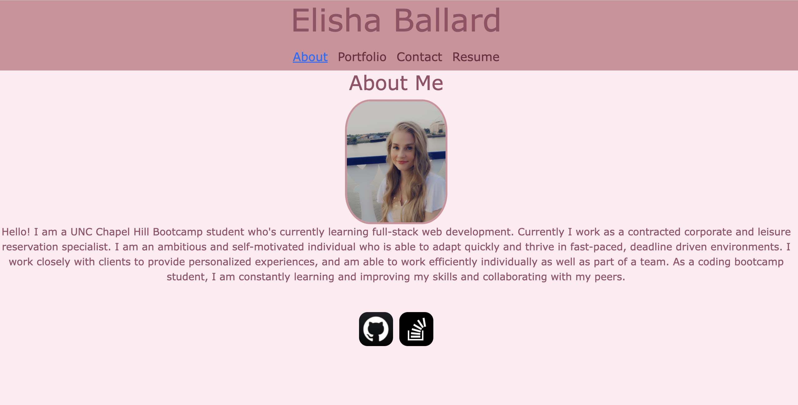

# My React Portfolio

## Table of Contents 
- [User Story](#user-story)
- [Description](#description)
- [Installation and Usage](#installation-and-usage)
- [Visual Representation](#visual-representation)
- [Links](#links)

## User Story
`AS AN employer looking for candidates with experience building single-page applications
I WANT to view a potential employee's deployed React portfolio of work samples
SO THAT I can assess whether they're a good candidate for an open position`

## Description

This is my portfolio created with React and bootstrap. This page includes some information about me, some of the projects I have completed and also includes my resume.

## Installation and Usage

- Download through GitHub
- Run npm i inside terminal to install packages.
- Run npm start to open React app.

Link to deployed page:
 https://ldom3976.github.io/my-react-portfolio/

## Visual Representation

## Links

- Github: [Elisha Ballard](https://github.com/ldom3976)